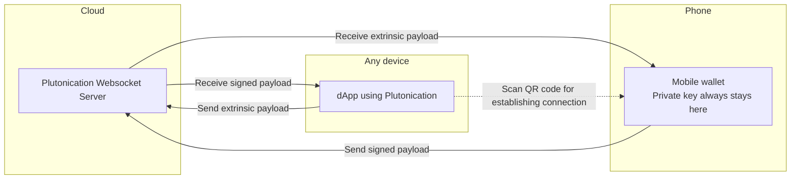

# Plutonication


Communications protocol that enables seamless interactions between dApps and wallets across all platforms.

Establishing a connection is as easy as scanning a QR code.

This is a c# version.

Short demo: https://youtu.be/hw2B8-sBc9A?si=S4BBA3LEib-BYw5m

# Use with any web dApp


You can use plutonication **now** with any web dApp. Just download **Plutonication Extension**.

You can find it here: https://github.com/RostislavLitovkin/PlutonicationExtension

# Installation

Nuget package: https://www.nuget.org/packages/Plutonication
```
dotnet add package Plutonication
```

# Other versions

- Javascript/Typescript = https://github.com/rostislavLitovkin/plutonication
- Kotlin - planned
- Swift - planned

# Use of Plutonication

The overall structure of Plutonication is designed to be as little intrusive as possible.

If you are building a dApp, you will want to interact with `PlutonicationDAppClient` static class.

Here is how (This is outdated. I will update it soon):

```C#
use Plutonication
use Substrate.NetApi

// Access credentials are used to show correct info to the wallet.
AccessCredentials ac = new AccessCredentials
{
    // Plutonication endpoint url - leave this as is
    Url = "wss://plutonication-53tvi.ondigitalocean.app/plutonication",

    // Name of the dApp
    Name = "Galaxy Logic Game",

    // dApp icon
    Icon = "https://rostislavlitovkin.pythonanywhere.com/logo",

    // Unique key used for differentiating - leave this as is
    Key = AccessCredentials.GenerateKey(),
};

// Create a client that connects to the RPC node
// this uses Substrate.NetApi
SubstrateClient substrateClient = new SubstrateClient(
    // RPC node endpoint
    new Uri("wss://rococo-asset-hub-rpc.polkadot.io"),
    Substrate.NetApi.Model.Extrinsics.ChargeTransactionPayment.Default());

await PlutonicationDAppClient.InitializeAsync(
    ac,
    pubkey =>
    {
        // Do something with the pubkey,
        // For example show it to the user.
        Console.WriteLine(pubkey);
    },
    substrateClient);

// Use AccessCredentials to generate a link for connecting.
// Use this link to generate a correct QR code.
// You may use a package like https://github.com/Redth/ZXing.Net.Maui for QR code generation.
qrCode.Value = ac.ToUri().ToString();

// Asure that the pubkey has been received
// ..

// Now you can send payloads
// Do not forget to import other types from Substrate.NetApi
EnumMultiAddress mint_to = new EnumMultiAddress();
var account32 = new AccountId32();
account32.Create(Utils.GetPublicKeyFrom(pubkey));
mint_to.Create(MultiAddress.Id, account32);

System.Collections.Generic.List<byte> parameters = new List<byte>();

// collectionId
parameters.AddRange(new U32(7).Encode());

// itemId
parameters.AddRange(new U32(0).Encode());

// mintTo
parameters.AddRange(mint_to.Encode());

// witnessData
parameters.AddRange(new byte[0] { });

// Send the payload to the wallet for signing.
await PlutonicationDAppClient.SendPayloadAsync(52, 3, parameters.ToArray());
```

# Problem / Motivation

Currently, there is no way to connect a wallet to more exotic devices, like gaming console and wearables.

# How it works

1) The private key is always saved in your wallet on your phone and is never sent anywhere.
2) You need to pair the dApp with the wallet.
   To do so, the wallet needs to receive a special link with information needed to establish the connection.
   The wallet can receive this link for example by scanning a QR code.
3) Once the link is received, the dApp and the wallet will get paired via websockets.
   This is to establish a stable connection between different platforms.
4) After the connection is established, the wallet is ready to receive any Extrinsics, which it can then sigh and send back to the dApp.

# Structure

Native plutonication:



Plutonication on existing polkadot.js apps: 
```mermaid
flowchart LR

subgraph Cloud
S[Plutonication Websocket Server]
end

subgraph Web
D[dApp using Polkadot.js] ~~~ E[Plutonication Extension]
E -. Connection via Polkadot.js extension .- D
end

subgraph Phone
W["Mobile wallet
    Private key always stays here"]
end

S -- Receive signed payload --> E
E -- Send extrinsic payload --> S

S -- Receive extrinsic payload --> W
W -- Send signed payload --> S

E -. Scan QR code for establishing connection .-> W;
```

### Plutonication Server
- Used for reliable establishing of connection.
- Passes payloads between Wallets and dApps.

### Mobile Wallet
- Has access to the private key
- signs the payloads and sends them back to the dApp.
- Never exposes the private key

### dApp
- needs to have access to either: Plutonication Native / Plutonication Extension

### Plutonication Native
- A simple package that allows the dApp get connected with the Mobile Wallet.
- Connects the dApp with the Plutonication server.
- Helps to generate a QR code for the Wallet to establish the connection.

### Plutonication Extension
- a polkadot.js extension that works with any existing dApp that supports polkadot.js extension.
- Connects the dApp with the Plutonication server.
- Generate a QR code for the Wallet to establish the connection.

# Limitations

- both devices need to support internet connection

# dApps utilising Plutonication

- [Plutonication Extension](https://github.com/RostislavLitovkin/PlutonicationExtension)
- [Galaxy Logic Game](https://github.com/RostislavLitovkin/galaxylogicgamemaui)

Feel free to add your own project by making a PR.

# Wallets utilising Plutonication

- [PlutoWallet](https://github.com/RostislavLitovkin/PlutoWallet)

Feel free to add your own project by making a PR.

# Inspiration

- https://walletconnect.com/
